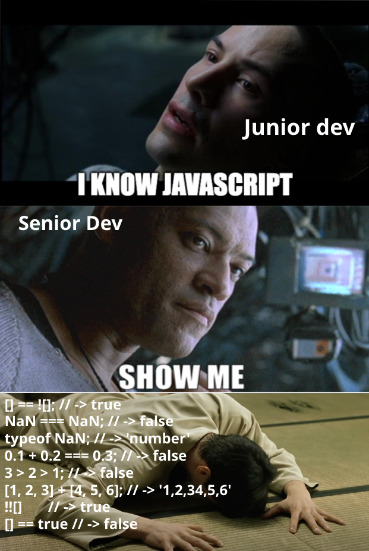
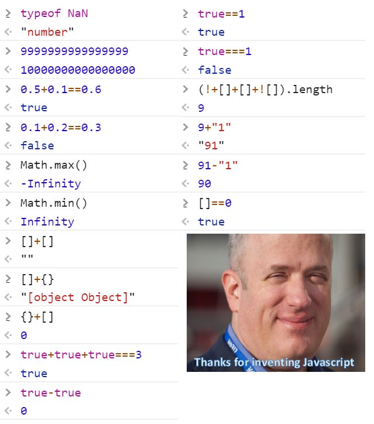

## Exercises

What happens when you add 0 to the values NaN, Infinity, false, true, null, and undefined? What happens when you concatenate the empty string with NaN, Infinity, false, true, null, and undefined? Guess first and then try it out.

Check the results and Explain your findings,
[] + []
{} + []
[] + {}
{} + {}
[] - {}

As in Java and C++ (and unlike Python which follows many centuries of mathematical experience), n % 2 is -1 if n is a negative integer. Explore the behavior of the % operator for negative operands. Analyze integers and floating-point numbers.

Suppose angle is some angle in degrees that, after adding or subtracting other angles, has assumed an arbitrary value. You want to normalize it so that it is between 0 (inclusive) and 360 (exclusive). How do you do that with the % operator?

List as many different ways as you can to produce the string with two backslash characters \\ in JavaScript, using the mechanisms described in this chapter.

List as many different ways as you can to produce the string with the single character Images in JavaScript.

Give a realistic example in which a template string has an embedded expression that contains another template string with an embedded expression.

Give three ways of producing an array with a “hole” in the index sequence.

Declare an array with elements at index positions 0, 0.5, 1, 1.5, and 2.

What happens when an array of arrays is converted to a string?

Make a couple of objects representing people and store them in variables harry and sally. To each person, add a property friends that contains an array with their best friends. Suppose harry is a friend of sally and sally is a friend of harry. What happens when you log each object? What happens when you call JSON.stringify?