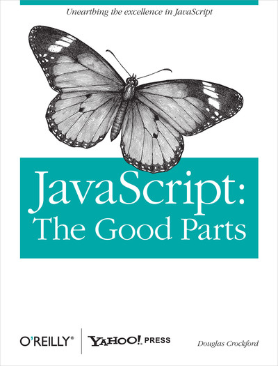

# JavaScript Watchlist

## JavaScript: The good parts.
- [Video](https://www.youtube.com/watch?v=hQVTIJBZook)

## The Birth & Death of JavaScript

- [Video](https://www.destroyallsoftware.com/talks/the-birth-and-death-of-javascript)

## JavaScript is stange
- [Video](https://www.youtube.com/watch?v=sRWE5tnaxlI)
## JavaScript type coercion explained
- [Blogpost](https://www.freecodecamp.org/news/js-type-coercion-explained-27ba3d9a2839/)

## MIT Public Content

[MIT Public Content](https://ocw.mit.edu/search/?d=Electrical%20Engineering%20and%20Computer%20Science&s=department_course_numbers.sort_coursenum)